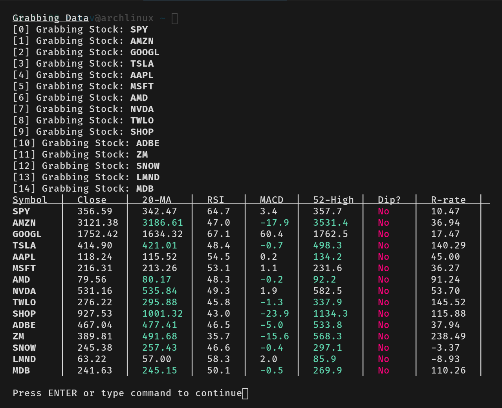

# PyRa
I got bored of browsing the web for Market Data so I made a script that does it for me.

## Functionality
Running main.py via `python main.py` will run the two scripts `calc` and `term`.

Stock or Symbol data is grabbed from Yahoo. (ensure the symbols in stocks.csv are listes as they are shown in Yahoo, otherwise exceptions will be thrown)

1. `calc` is the heart of the computation. Calculating MACD, RSI, 52-week-high, Bollinger Bands and Percent Return Rate over the time frame.
2. `term` is mainly for outputting to the terminal, instead of a outputting a raw dataframe. See preview below.

### Preview:

